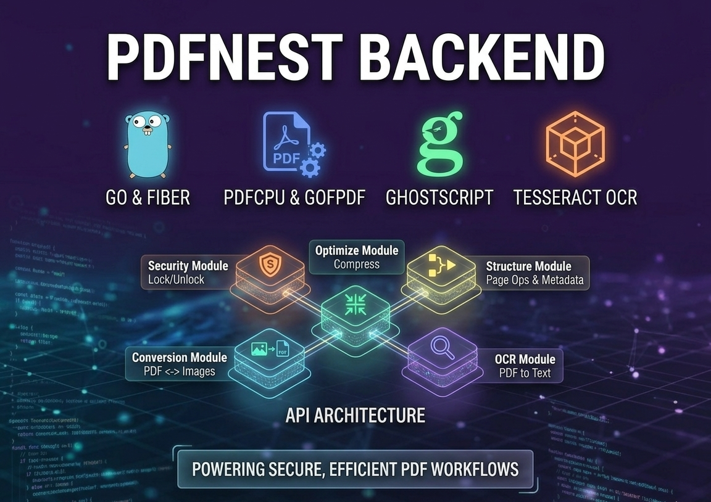

# Platen PDF Backend

Platen PDF Backend is the Go/Fiber API that powers the Platen PDF platform. It handles document security, optimization, page organization, conversion, extraction, and editing workflows, while a separate FastAPI worker service performs the heavier PDF processing tasks over HTTP.

## What this backend does

The Go backend is now the orchestration layer for:

- authentication, billing, and app routing
- PDF security actions such as lock and unlock
- PDF optimization and grayscale/compression
- structure actions such as merge, split, rotate, crop, delete pages, reorder pages, duplicate pages, insert blank pages, add text, repair, and add page numbers
- conversion helpers such as images to PDF, PDF to images, office document conversion, URL to PDF, Markdown to PDF, code to PDF, and HTML preview/print flows
- OCR/text extraction routes
- markup workflows for highlight, underline, and strikeout, including job status and download endpoints
- worker-backed metadata, redaction, signing, and analyzer flows

## Architecture

Platen PDF is split into two services:

- Go backend: public API, billing, auth, database access, landing page, and route orchestration
- FastAPI worker: PDF processing runtime for the tools that used to rely on local Python execution

The backend now talks to the worker through `PDFNEST_WORKER_URL` instead of running Python scripts locally.

## Tech stack

- Go 1.26
- Fiber v2
- PostgreSQL
- pdfcpu
- Ghostscript
- Tesseract OCR
- chromedp for HTML to PDF and page preview flows
- FastAPI worker service for PDF processing
- Docker for deployment

## Prerequisites

Install Go and the native system tools used by the backend.

```bash
go version
gs --version
tesseract --version
chromium --version
```

On Ubuntu/Debian:

```bash
sudo apt update
sudo apt install ghostscript tesseract-ocr chromium
```

## Getting started

Install Go dependencies:

```bash
go mod download
```

Run the backend:

```bash
go run .
```

The server starts on:

```text
http://localhost:8080
```

The landing page is available at `/`, and the main API is mounted under `/api`.

## Environment variables

Required or commonly used variables:

- `PORT=10000`
- `ALLOWED_ORIGINS=http://localhost:3000`
- `DATABASE_URL=...`
- `JWT_SECRET=...`
- `FRONTEND_URL=...`
- `BACKEND_URL=...`
- `PDFNEST_WORKER_URL=http://localhost:8000`
- `APP_ENV=development` or `production`

check .env.example

## Project structure

```text
.
├── main.go
├── config/
├── internal/
│   ├── admin/
│   ├── auth/
│   ├── billing/
│   ├── content/
│   ├── conversion/
│   ├── edit/
│   ├── health/
│   ├── landing/
│   ├── markup/
│   ├── middleware/
│   ├── models/
│   ├── ocr/
│   ├── optimize/
│   ├── pdfdraw/
│   ├── security/
│   ├── structure/
│   ├── tasks/
│   └── worker/
├── render.yaml
├── Dockerfile
├── Dockerfile.dev
└── go.mod
```

## API reference

All file-based endpoints use `multipart/form-data`.

### Health

| Method | Endpoint | Response |
| --- | --- | --- |
| GET | `/api/health` | JSON status payload |

### Security

| Method | Endpoint | Fields | Response |
| --- | --- | --- | --- |
| POST | `/api/security/lock` | `file`, `password` | Locked PDF |
| POST | `/api/security/unlock` | `file`, `password` | Unlocked PDF |
| POST | `/api/security/redact-text` | `file`, `keywords`, `boxes` | Redacted PDF |

Example:

```bash
curl -X POST http://localhost:8080/api/security/lock   -F "file=@document.pdf"   -F "password=secret"   --output locked.pdf
```

### Optimization

| Method | Endpoint | Fields | Response |
| --- | --- | --- | --- |
| POST | `/api/optimize/compress` | `file` | Compressed PDF |
| POST | `/api/optimize/grayscale` | `file` | Grayscale PDF |

### Structure

| Method | Endpoint | Fields | Response |
| --- | --- | --- | --- |
| POST | `/api/structure/analyze` | `file`, optional `file_password` | PDF analysis JSON |
| POST | `/api/structure/merge` | repeated `files` | Merged PDF |
| POST | `/api/structure/split` | `file`, `pages` | Split PDF |
| POST | `/api/structure/rotate` | `file`, `rotations` | Rotated PDF |
| POST | `/api/structure/delete-pages` | `file`, `pages` | PDF with pages removed |
| POST | `/api/structure/reorder-pages` | `file`, `sequence` | Reordered PDF |
| POST | `/api/structure/watermark` | `file`, `text` or `watermarkImage`, optional `description` | Watermarked PDF |
| POST | `/api/structure/add-page-numbers` | `file`, optional `description` | Numbered PDF |
| POST | `/api/structure/update-metadata` | `file`, optional `password`, `title`, `author`, `subject`, `keywords` | Updated PDF |
| POST | `/api/structure/metadata/fetch` | `file`, optional `password` | Metadata JSON |
| POST | `/api/structure/repair` | `file` | Repaired PDF |
| POST | `/api/structure/sign` | `file`, signature-related fields | Signed PDF |
| POST | `/api/structure/crop` | `file`, crop settings | Cropped PDF |
| POST | `/api/structure/duplicate` | `file`, page selection, copies | Duplicated pages PDF |
| POST | `/api/structure/insert-blank` | `file`, insert options, count | PDF with blank pages |
| POST | `/api/structure/add-text` | `file`, text elements JSON | PDF with text overlays |

### Conversion

| Method | Endpoint | Fields | Response |
| --- | --- | --- | --- |
| POST | `/api/conversion/preview/page` | `file`, `page`, `scale`, optional `file_password` | Page preview image |
| POST | `/api/conversion/to-pdf` | `images` repeated one or more times | PDF |
| POST | `/api/conversion/custom-to-pdf` | images plus layout data | PDF |
| POST | `/api/conversion/pdf-to-images` | `file` | ZIP of page images |
| POST | `/api/conversion/word-to-pdf` | `file` | PDF |
| POST | `/api/conversion/excel-to-pdf` | `file` | PDF |
| POST | `/api/conversion/powerpoint-to-pdf` | `file` | PDF |
| POST | `/api/conversion/url-to-pdf` | `url` or URL payload | PDF |
| POST | `/api/conversion/markdown-to-pdf` | markdown input | PDF |
| POST | `/api/conversion/code-to-pdf` | code input | PDF |
| POST | `/api/conversion/pdf-to-word` | `file` | DOCX |
| POST | `/api/conversion/pdf-to-excel` | `file` | XLSX |
| POST | `/api/conversion/pdf-to-powerpoint` | `file` | PPTX |

### OCR

| Method | Endpoint | Fields | Response |
| --- | --- | --- | --- |
| POST | `/api/ocr/extract-text` | `file` | Plain text file |
| POST | `/api/ocr/to-text-pdf` | `images` repeated one or more times | PDF |

### Edit

| Method | Endpoint | Fields | Response |
| --- | --- | --- | --- |
| POST | `/api/edit/extract` | `file` | Worker job submission |
| POST | `/api/edit/compile` | `file`, extracted payload | Worker job submission |
| GET | `/api/edit/jobs/:job_id` | - | Job status JSON |
| GET | `/api/edit/jobs/:job_id/download` | - | Download compiled result |

### Markup

Markup tools now return worker job IDs and are completed through status and download endpoints.

| Method | Endpoint | Fields | Response |
| --- | --- | --- | --- |
| POST | `/api/markup/highlight` | `file`, `boxes`, `mode`, optional `file_password` | Job submission JSON |
| POST | `/api/markup/underline` | `file`, `boxes`, `mode`, optional `file_password` | Job submission JSON |
| POST | `/api/markup/strikeout` | `file`, `boxes`, `mode`, optional `file_password` | Job submission JSON |
| GET | `/api/markup/jobs/:job_id` | - | Job status JSON |
| GET | `/api/markup/jobs/:job_id/download` | - | Finished PDF |

## Notes

- The backend accepts request bodies up to 100 MB.
- Temporary files are written to the operating system temp directory and removed after each request.
- PDF-to-image conversion requires `gs` from Ghostscript.
- OCR endpoints require `tesseract`.
- The backend now delegates worker-backed PDF processing through `PDFNEST_WORKER_URL`.
- Python helper scripts are no longer executed from the Go backend.

## Development

Format the code:

```bash
go fmt ./...
```

Run tests when test files are added:

```bash
go test ./...
```
