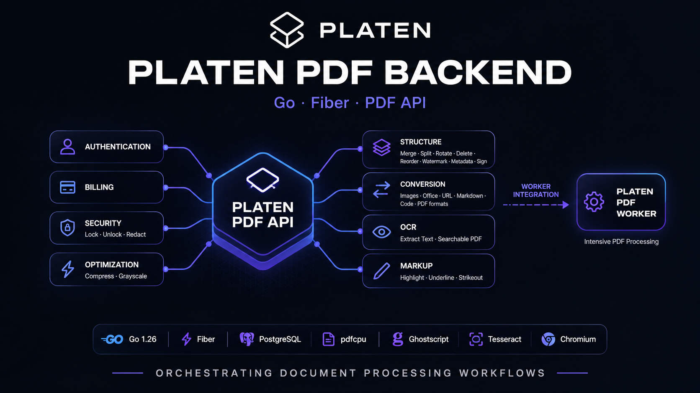

# Platen PDF Backend

## Overview

Platen PDF Backend is the Go/Fiber API that powers the Platen PDF platform. It orchestrates authentication, billing, PDF security, optimization, structure manipulation, conversion, OCR, and markup workflows, delegating heavy processing tasks to the Platen PDF Worker service.

## Features

- **Security**: Lock, unlock, redact PDFs.
- **Optimization**: Compress and convert PDFs to grayscale.
- **Structure**: Merge, split, rotate, delete, reorder, insert blank pages, add page numbers, watermark, edit metadata, repair, and sign PDFs.
- **Conversion**: Images → PDF, PDF → images, Office → PDF, URL → PDF, Markdown → PDF, Code → PDF, PDF → Word/Excel/PowerPoint.
- **OCR**: Extract text and create searchable PDFs.
- **Markup**: Highlight, underline, strikeout with asynchronous job handling.
- **Worker Integration**: Delegates intensive PDF processing to the Platen PDF Worker via `PDFNEST_WORKER_URL`.

## Tech Stack

- Go 1.26
- Fiber v2 (HTTP framework)
- PostgreSQL (data store)
- pdfcpu, Ghostscript, Tesseract OCR, chromedp
- FastAPI Worker service (PDF processing runtime)
- Docker for containerised deployment

## Prerequisites

```bash
go version
gs --version          # Ghostscript
tesseract --version   # OCR engine
chromium --version    # Chrome for html→pdf rendering
```

On Ubuntu/Debian install required system packages:

```bash
sudo apt update
sudo apt install ghostscript tesseract-ocr chromium
```

## Getting Started

```bash
# Install Go dependencies
go mod download

# Run the backend locally
go run .
```

The server listens on `http://localhost:8080`. The landing page is available at `/`, and the API is mounted under `/api`.

## Environment Variables

| Variable | Description |
|---|---|
| `PORT` | Port for the backend server (default `8080`). |
| `ALLOWED_ORIGINS` | Comma‑separated list of allowed frontend origins (e.g., `http://localhost:3000`). |
| `DATABASE_URL` | PostgreSQL connection string. |
| `JWT_SECRET` | Secret key for signing JWTs. |
| `FRONTEND_URL` | URL of the Platen PDF frontend. |
| `BACKEND_URL` | Public URL of this backend service. |
| `PDFNEST_WORKER_URL` | Base URL of the Platen PDF Worker service. |
| `APP_ENV` | `development` or `production`. |

See `.env.example` for a full list.

## API Reference

All file‑based endpoints accept `multipart/form-data`.

### Health

| Method | Endpoint | Response |
|---|---|---|
| GET | `/api/health` | JSON status payload |

### Security

| Method | Endpoint | Fields | Response |
|---|---|---|---|
| POST | `/api/security/lock` | `file`, `password` | Locked PDF |
| POST | `/api/security/unlock` | `file`, `password` | Unlocked PDF |
| POST | `/api/security/redact-text` | `file`, `keywords`, `boxes` | Redacted PDF |

### Optimization

| Method | Endpoint | Fields | Response |
|---|---|---|---|
| POST | `/api/optimize/compress` | `file` | Compressed PDF |
| POST | `/api/optimize/grayscale` | `file` | Grayscale PDF |

### Structure (examples)

| Method | Endpoint | Fields | Response |
|---|---|---|---|
| POST | `/api/structure/merge` | repeated `files` | Merged PDF |
| POST | `/api/structure/split` | `file`, `pages` | Split PDF |
| POST | `/api/structure/rotate` | `file`, `rotations` | Rotated PDF |
| POST | `/api/structure/watermark` | `file`, `text` or `watermarkImage` | Watermarked PDF |
| POST | `/api/structure/add-page-numbers` | `file` | Numbered PDF |
| POST | `/api/structure/update-metadata` | `file`, optional `title`, `author`, `subject`, `keywords` | Updated PDF |
| POST | `/api/structure/sign` | `file`, signature fields | Signed PDF |

### Conversion (examples)

| Method | Endpoint | Fields | Response |
|---|---|---|---|
| POST | `/api/conversion/to-pdf` | `images` (repeated) | PDF |
| POST | `/api/conversion/pdf-to-images` | `file` | ZIP of page images |
| POST | `/api/conversion/url-to-pdf` | `url` | PDF |
| POST | `/api/conversion/markdown-to-pdf` | markdown content | PDF |
| POST | `/api/conversion/code-to-pdf` | code files | PDF |

### OCR

| Method | Endpoint | Fields | Response |
|---|---|---|---|
| POST | `/api/ocr/extract-text` | `file` | Plain text file |
| POST | `/api/ocr/to-text-pdf` | `images` (repeated) | Searchable PDF |

### Edit (worker‑backed)

| Method | Endpoint | Fields | Response |
|---|---|---|---|
| POST | `/api/edit/extract` | `file` | Job submission JSON |
| POST | `/api/edit/compile` | `file`, extracted payload | Job submission JSON |
| GET | `/api/edit/jobs/:job_id` | – | Job status JSON |
| GET | `/api/edit/jobs/:job_id/download` | – | Compiled PDF |

### Markup (worker‑backed)

| Method | Endpoint | Fields | Response |
|---|---|---|---|
| POST | `/api/markup/highlight` | `file`, `boxes`, `mode` | Job submission JSON |
| POST | `/api/markup/underline` | `file`, `boxes`, `mode` | Job submission JSON |
| POST | `/api/markup/strikeout` | `file`, `boxes`, `mode` | Job submission JSON |
| GET | `/api/markup/jobs/:job_id` | – | Job status JSON |
| GET | `/api/markup/jobs/:job_id/download` | – | Finished PDF |

## Development

```bash
# Format code
go fmt ./...

# Run tests
go test ./...
```

## Notes

- Request bodies are limited to 100 MB.
- Temporary files are stored in the OS temp directory and cleaned up after each request.
- PDF‑to‑image conversion requires Ghostscript (`gs`).
- OCR endpoints require Tesseract.
- Worker integration is performed via `PDFNEST_WORKER_URL`.

## License

This project is licensed under the terms in [LICENSE](./LICENSE).
